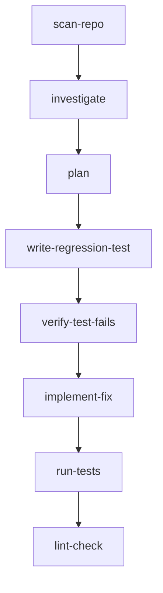

## Overview

The **Diagnostic blueprint** is Magpie's structured workflow for fixing bugs. Unlike the TDD blueprint which starts with planning, the Diagnostic blueprint enforces a **root cause investigation** step before any fixes are made.

The flow:

1. **Scan** the repo structure
2. **Investigate** the bug WITHOUT modifying files
3. **Plan** a targeted fix based on findings
4. **Write regression test** that reproduces the bug
5. **Verify test fails** (the bug exists)
6. **Implement fix** for the root cause
7. **Verify tests pass** (bug is fixed)
8. **Lint** for code quality

<Note>
The key difference from TDD is the **investigate** step (step 2) which forces the agent to trace the root cause before planning a fix. This prevents band-aid solutions.
</Note>

## Task Classification

Magpie automatically classifies tasks as **BugFix** if they match any of these keywords:

```rust
const BUGFIX_KEYWORDS: &[&str] = &[
    "fix bug",
    "fix the bug",
    "fix crash",
    "fix the crash",
    "fix error",
    "fix the error",
    "fix panic",
    "fix the panic",
    "broken",
    "not working",
    "regression",
    "debug",
    "investigate",
    "root cause",
    "diagnose",
];
```

From `crates/magpie-core/src/pipeline.rs:129-145`

**Important:** `SIMPLE_KEYWORDS` are checked *before* `BUGFIX_KEYWORDS`, so "fix typo" stays Simple (not BugFix).

### Examples

<CodeGroup>

```text BugFix (diagnostic flow)
fix crash in webhook handler
fix the bug in authentication
broken: tests fail on CI
investigate panic in parser
```

```text Simple (not a bug fix)
fix typo in readme
fix comment in module.rs
```

</CodeGroup>

## Blueprint Structure

The Diagnostic blueprint has **8 steps**:



### Step 1: scan-repo

Identical to TDD blueprint — get file tree for context:

```rust
Step {
    name: "scan-repo".to_string(),
    kind: StepKind::Shell(ShellStep::new("find").with_args(vec![
        repo_dir,
        "-type".to_string(),
        "f".to_string(),
        "-not", "-path", "*/.git/*",
        "-not", "-path", "*/target/*",
        "-not", "-path", "*/node_modules/*",
    ])),
    condition: Condition::Always,
    continue_on_error: false,
}
```

From `crates/magpie-core/src/pipeline.rs:539-557`

### Step 2: investigate (UNIQUE TO DIAGNOSTIC)

The agent traces the root cause **WITHOUT modifying any files**:

```rust
Step {
    name: "investigate".to_string(),
    kind: StepKind::Agent(
        AgentStep::new(format!(
            "You are investigating a bug. The file tree of the repository \
             is provided as previous step output.\n\n\
             Bug report: {}\n\n\
             Your job is to find the ROOT CAUSE. Do NOT plan a fix yet. \
             Do NOT modify any files.\n\n\
             Instructions:\n\
             1. Trace the data flow through the affected code path\n\
             2. Read the relevant source files\n\
             3. Identify the exact location where behavior diverges from expectation\n\
             4. Name the specific files, functions, and line numbers involved\n\
             5. Explain WHY the bug occurs (not just WHAT happens)\n\n\
             Output a clear investigation report with your findings.",
            trigger.message
        ))
        .with_last_output()
        .with_context_from_metadata("chat_history"),
    ),
    condition: Condition::Always,
    continue_on_error: false,
}
```

From `crates/magpie-core/src/pipeline.rs:572-594`

**Why this matters:**
- Prevents jumping to conclusions ("just add a null check")
- Forces understanding of the data flow
- Results in targeted fixes instead of workarounds

**Example investigation output:**
```
ROOT CAUSE ANALYSIS:

The panic occurs in src/parser.rs:142 when parse_config() receives
an empty input string.

Data flow:
1. main.rs:45 reads config file with fs::read_to_string()
2. If file is empty, returns Ok("") (not an error)
3. parser.rs:142 calls unwrap() on split(",").next(), which panics on empty string

WHY IT HAPPENS:
The parser assumes input is non-empty and has at least one comma-separated value.
No validation exists before the unwrap().

AFFECTED CODE:
src/parser.rs:142 — let first = parts.next().unwrap();
```

### Step 3: plan

Based on the investigation findings, plan a **targeted fix**:

```rust
Step {
    name: "plan".to_string(),
    kind: StepKind::Agent(
        AgentStep::new(format!(
            "Based on the investigation findings from the previous step, \
             plan a targeted fix.\n\n\
             Bug report: {}\n\n\
             Create a brief plan:\n\
             1. What is the root cause (from investigation)\n\
             2. What specific changes to make and why\n\
             3. What regression test to write\n\n\
             Be concise — this plan guides the next steps.",
            trigger.message
        ))
        .with_last_output()
        .with_context_from_metadata("chat_history"),
    ),
    condition: Condition::Always,
    continue_on_error: false,
}
```

From `crates/magpie-core/src/pipeline.rs:610-628`

**Example plan:**
```
1. Root cause:
   parser.rs:142 panics on empty input due to unwrap() on empty iterator

2. Specific changes:
   - Replace unwrap() with ok_or() to return Result<Config, ParseError>
   - Add validation at start of parse_config() to check for empty input
   - Update main.rs error handling to propagate ParseError

3. Regression test:
   - test_parse_empty_config() in tests/parser_test.rs
   - Should verify parse_config("") returns Err(ParseError::EmptyInput)
```

### Step 4: write-regression-test

Write a test that **reproduces the bug** with current code:

```rust
Step {
    name: "write-regression-test".to_string(),
    kind: StepKind::Agent(
        AgentStep::new(format!(
            "Based on the plan from the previous step, write a regression test \
             that REPRODUCES the bug.\n\n\
             Bug report: {}\n\n\
             Rules:\n\
             - The test should FAIL with the current (buggy) code\n\
             - It should PASS once the fix is applied\n\
             - Use the project's existing test patterns and framework\n\
             - Do NOT implement the fix yet — only the test",
            trigger.message
        ))
        .with_last_output()
        .with_context_from_metadata("chat_history"),
    ),
    condition: Condition::Always,
    continue_on_error: false,
}
```

From `crates/magpie-core/src/pipeline.rs:645-662`

**Example test:**
```rust
#[test]
fn test_parse_empty_config() {
    let result = parse_config("");
    assert!(result.is_err());
    match result.unwrap_err() {
        ParseError::EmptyInput => {}, // expected
        other => panic!("expected EmptyInput, got {other:?}"),
    }
}
```

### Step 5: verify-test-fails

Run tests and expect the regression test to **fail** (the bug exists):

```rust
Step {
    name: "verify-test-fails".to_string(),
    kind: StepKind::Shell(ShellStep::new(test_cmd.clone()).with_args(test_args.clone())),
    condition: Condition::Always,
    continue_on_error: true, // expected to fail
}
```

From `crates/magpie-core/src/pipeline.rs:666-671`

**Example output:**
```
test parser_test::test_parse_empty_config ... FAILED

thread 'parser_test::test_parse_empty_config' panicked at 'called `Option::unwrap()` on a `None` value'
```

### Step 6: implement-fix

Fix the **root cause** (not just symptoms):

```rust
Step {
    name: "implement-fix".to_string(),
    kind: StepKind::Agent(
        AgentStep::new(format!(
            "The regression test from the previous step has been run. The output \
             (including failures) is provided as previous step output.\n\n\
             Bug report: {}\n\n\
             Now fix the ROOT CAUSE identified in the investigation step.\n\
             - Do NOT use workarounds or band-aids\n\
             - Fix the underlying issue, not just the symptoms\n\
             - Make sure the regression test passes\n\
             - Do not break existing tests",
            trigger.message
        ))
        .with_last_output()
        .with_context_from_metadata("chat_history"),
    ),
    condition: Condition::Always,
    continue_on_error: false,
}
```

From `crates/magpie-core/src/pipeline.rs:687-704`

**Example fix:**
```rust
pub fn parse_config(input: &str) -> Result<Config, ParseError> {
    if input.is_empty() {
        return Err(ParseError::EmptyInput);
    }
    
    let parts: Vec<&str> = input.split(',').collect();
    let first = parts.first().ok_or(ParseError::MissingField)?;
    
    Ok(Config {
        name: first.to_string(),
    })
}
```

### Step 7: run-tests

Run all tests and expect **pass** (bug is fixed):

```rust
Step {
    name: "run-tests".to_string(),
    kind: StepKind::Shell(ShellStep::new(test_cmd).with_args(test_args)),
    condition: Condition::Always,
    continue_on_error: true,
}
```

From `crates/magpie-core/src/pipeline.rs:708-713`

### Step 8: lint-check

Run linter to catch code quality issues:

```rust
Step {
    name: "lint-check".to_string(),
    kind: StepKind::Shell(ShellStep::new(lint_cmd).with_args(lint_args)),
    condition: Condition::Always,
    continue_on_error: true,
}
```

From `crates/magpie-core/src/pipeline.rs:716-721`

## Full Blueprint Code

```rust
pub fn build_diagnostic_blueprint(
    trigger: &TriggerContext,
    config: &PipelineConfig,
    working_dir: &str,
) -> Result<(Blueprint, StepContext)> {
    let mut ctx = StepContext::new(PathBuf::from(working_dir));
    trigger.hydrate(&mut ctx);
    if let Some(ref dir) = config.trace_dir {
        ctx.metadata
            .insert("trace_dir".to_string(), dir.display().to_string());
    }

    let repo_dir = working_dir.to_string();
    let (test_cmd, test_args) = split_command(&config.test_command);
    let (lint_cmd, lint_args) = split_command(&config.lint_command);

    let mut blueprint = Blueprint::new("magpie-diagnostic");

    // Step 1: scan-repo
    blueprint = blueprint.add_step(/* ... */);
    // Step 2: investigate
    blueprint = blueprint.add_step(/* ... */);
    // Step 3: plan
    blueprint = blueprint.add_step(/* ... */);
    // Step 4: write-regression-test
    blueprint = blueprint.add_step(/* ... */);
    // Step 5: verify-test-fails
    blueprint = blueprint.add_step(/* ... */);
    // Step 6: implement-fix
    blueprint = blueprint.add_step(/* ... */);
    // Step 7: run-tests
    blueprint = blueprint.add_step(/* ... */);
    // Step 8: lint-check
    blueprint = blueprint.add_step(/* ... */);

    Ok((blueprint, ctx))
}
```

From `crates/magpie-core/src/pipeline.rs:515-724`

## Execution Timeline

**Example:** `fix crash in webhook handler`

```
[1/8] scan-repo (shell) → OK (exit 0)
[2/8] investigate (agent) → OK (6 turns, $0.14)
[3/8] plan (agent) → OK (2 turns, $0.04)
[4/8] write-regression-test (agent) → OK (4 turns, $0.08)
[5/8] verify-test-fails (shell) → exit 101 (continuing)
[6/8] implement-fix (agent) → OK (5 turns, $0.11)
[7/8] run-tests (shell) → OK (exit 0)
[8/8] lint-check (shell) → OK (exit 0)

Diagnostic tests+lint passed inside blueprint — skipping CI round 1
```

**Total:** ~8-12 minutes, 17 agent turns, ~$0.37

## Comparison: Diagnostic vs TDD

| Aspect | TDD Blueprint | Diagnostic Blueprint |
|--------|---------------|----------------------|
| **Use case** | New features, refactors | Bug fixes, regressions |
| **Step count** | 7 steps | 8 steps |
| **Key difference** | Starts with plan | Starts with **investigate** |
| **Test writing** | Write tests for *expected* behavior | Write test that *reproduces* bug |
| **Agent turns** | 15-30 | 15-25 |
| **Wall time** | 5-15 min | 8-15 min |

**Why investigate matters:**

Without the investigation step, agents tend to:
- Apply band-aid fixes ("just add a null check")
- Miss edge cases
- Fix symptoms instead of root causes
- Introduce regressions

The investigation step forces **understanding before action**.

## CI Retry Loop

Identical to TDD blueprint:

```rust
let tdd_tests_passed = ctx.last_exit_code == Some(0);

if tdd_tests_passed {
    ci_passed = true;
    info!("Diagnostic tests+lint passed inside blueprint — skipping CI round 1");
} else {
    // Retry up to max_ci_rounds with build_fix_blueprint()
}
```

From `crates/magpie-core/src/pipeline.rs:1001-1026`

## Common Pitfalls

<Warning>
**Vague Bug Reports**

If your task message is "fix the bug", the agent has no context. Provide:
- Where the bug happens (file, function, scenario)
- What the expected behavior is
- What actually happens (error message, panic, wrong output)

**Good:** `fix crash in webhook handler when payload is missing signature header`

**Bad:** `fix the bug`
</Warning>

<Tip>
**Investigation Output is Gold**

If the fix fails, review the investigation step output in agent traces. Often the root cause analysis is correct but the fix implementation is wrong.
</Tip>

## Performance

Diagnostic tasks are **slower** than TDD due to investigation overhead:

- **Agent turns:** 15-25 (investigation + tests + fix)
- **Wall time:** 8-15 minutes (local sandbox)
- **Cost:** $0.30-0.70 per task (Claude API)
- **Success rate:** ~80% (slightly lower than TDD due to harder problems)

## Real-World Example

**Task:** `fix panic when config file is empty`

**Investigation output:**
```
ROOT CAUSE: parser.rs:67 calls unwrap() on split().next() without checking
if input is empty. When config file is empty, split() returns empty iterator,
next() returns None, unwrap() panics.

DATA FLOW:
1. main.rs:23 → fs::read_to_string("config.toml")
2. Returns Ok("") for empty file (not an error)
3. parser.rs:67 → input.split(',').next().unwrap()
4. Panic: "called `Option::unwrap()` on a `None` value"

FIX LOCATION: parser.rs:67
FIX APPROACH: Replace unwrap() with ok_or(ParseError::EmptyInput)
```

**Plan output:**
```
1. Root cause: unwrap() on empty iterator
2. Changes:
   - Add ParseError::EmptyInput variant
   - Replace unwrap() with ok_or()
   - Add early return if input.is_empty()
3. Regression test: test_parse_empty_config() → expects Err(EmptyInput)
```

**Result:** Bug fixed, regression test added, all tests pass.

## Next Steps

<CardGroup cols={2}>
  <Card title="Custom Blueprints" icon="wrench" href="/blueprints/custom">
    Build your own investigation workflows
  </Card>
  <Card title="Simple Blueprint" icon="bolt" href="/blueprints/simple">
    See how simple tasks skip structured workflows
  </Card>
</CardGroup>