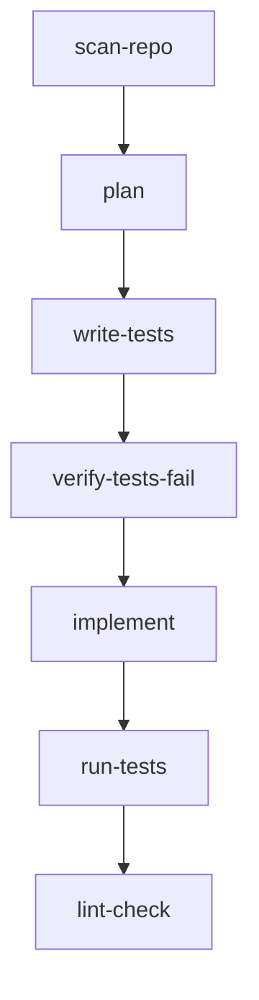

## Overview

The **TDD (Test-Driven Development) blueprint** is Magpie's structured workflow for implementing new features, refactors, and integrations. It enforces a disciplined cycle:

1. **Plan** the implementation
2. **Write tests** that define expected behavior
3. **Verify tests fail** (red phase)
4. **Implement** the feature to make tests pass
5. **Verify tests pass** (green phase)
6. **Lint** for code quality

<Note>
The TDD blueprint is selected automatically when Magpie classifies a task as **Standard** complexity.
</Note>

## Task Classification

Magpie automatically classifies tasks as **Standard** if they match any of these keywords:

```rust
const STANDARD_KEYWORDS: &[&str] = &[
    "add",
    "implement",
    "create",
    "build",
    "refactor",
    "migrate",
    "integrate",
    "introduce",
    "design",
    "architect",
    "extract",
    "replace",
    "rewrite",
    "optimize",
    "convert",
];
```

From `crates/magpie-core/src/pipeline.rs:148-164`

### Examples

<CodeGroup>

```text Standard (TDD flow)
add OAuth2 authentication
implement webhook validation
refactor blueprint engine
migrate to async runtime
```

```text Simple (skips TDD)
update readme
fix typo in comment
rename Config to Settings
```

</CodeGroup>

## Blueprint Structure

The TDD blueprint has **7 steps**:



### Step 1: scan-repo

Get a file tree of the repository for the agent to understand project structure:

```rust
Step {
    name: "scan-repo".to_string(),
    kind: StepKind::Shell(ShellStep::new("find").with_args(vec![
        repo_dir,
        "-type".to_string(),
        "f".to_string(),
        "-not".to_string(),
        "-path".to_string(),
        "*/.git/*".to_string(),
        "-not".to_string(),
        "-path".to_string(),
        "*/target/*".to_string(),
        "-not".to_string(),
        "-path".to_string(),
        "*/node_modules/*".to_string(),
    ])),
    condition: Condition::Always,
    continue_on_error: false,
}
```

From `crates/magpie-core/src/pipeline.rs:367-385`

**Output example:**
```
./src/main.rs
./src/lib.rs
./tests/integration_test.rs
./Cargo.toml
```

This context helps the agent understand where to add new files or modify existing ones.

### Step 2: plan

The agent reads the repo tree and chat history, then creates a brief implementation plan:

```rust
Step {
    name: "plan".to_string(),
    kind: StepKind::Agent(
        AgentStep::new(format!(
            "You are planning how to implement a task. The file tree of the repository \
             is provided as previous step output.\n\n\
             Task: {}\n\n\
             Create a brief plan:\n\
             1. Which files to modify or create\n\
             2. What tests to write (test names and what they verify)\n\
             3. Implementation approach (key functions/types to add or change)\n\n\
             Be concise — this plan guides the next steps.",
            trigger.message
        ))
        .with_last_output()
        .with_context_from_metadata("chat_history"),
    ),
    condition: Condition::Always,
    continue_on_error: false,
}
```

From `crates/magpie-core/src/pipeline.rs:400-418`

**Key details:**
- `.with_last_output()` injects the file tree from step 1
- `.with_context_from_metadata("chat_history")` adds Discord/Teams conversation
- The agent **doesn't modify files yet** — just plans

**Example plan output:**
```
1. Files to modify:
   - src/auth.rs (add OAuth2 flow)
   - tests/auth_test.rs (new file for tests)

2. Tests to write:
   - test_oauth2_token_exchange() — verify token request works
   - test_invalid_credentials() — verify proper error handling

3. Implementation:
   - Add OAuth2Client struct with exchange_code() method
   - Use reqwest for HTTP requests to token endpoint
   - Return Result<Token, AuthError>
```

### Step 3: write-tests

The agent writes **test code ONLY** based on the plan:

```rust
Step {
    name: "write-tests".to_string(),
    kind: StepKind::Agent(
        AgentStep::new(format!(
            "Based on the plan from the previous step, write ONLY test code.\n\n\
             Task: {}\n\n\
             Rules:\n\
             - Write test functions that verify the expected behavior\n\
             - Do NOT implement the actual feature yet\n\
             - Tests should fail when run (the implementation doesn't exist yet)\n\
             - Use the project's existing test patterns and framework\n\
             - Include both happy-path and edge-case tests",
            trigger.message
        ))
        .with_last_output()
        .with_context_from_metadata("chat_history"),
    ),
    condition: Condition::Always,
    continue_on_error: false,
}
```

From `crates/magpie-core/src/pipeline.rs:434-452`

**Why this matters:** By writing tests first, we define the API contract before implementation. This prevents scope creep and ensures testability.

### Step 4: verify-tests-fail

Run the test suite and **expect failures** (TDD red phase):

```rust
Step {
    name: "verify-tests-fail".to_string(),
    kind: StepKind::Shell(ShellStep::new(test_cmd.clone()).with_args(test_args.clone())),
    condition: Condition::Always,
    continue_on_error: true, // expected to fail
}
```

From `crates/magpie-core/src/pipeline.rs:456-461`

**Key:** `continue_on_error: true` allows the blueprint to proceed even when tests fail. This is the **red phase** — we *want* failures here.

**Example output:**
```
test auth_test::test_oauth2_token_exchange ... FAILED
test auth_test::test_invalid_credentials ... FAILED

error[E0433]: failed to resolve: use of undeclared type `OAuth2Client`
```

### Step 5: implement

The agent receives the test failure output and implements the feature:

```rust
Step {
    name: "implement".to_string(),
    kind: StepKind::Agent(
        AgentStep::new(format!(
            "The tests from the previous step have been run. The output (including any \
             failures or compilation errors) is provided as previous step output.\n\n\
             Task: {}\n\n\
             Now write the implementation to make all tests pass.\n\
             - Fix any compilation errors in the tests if needed\n\
             - Implement the actual feature/change\n\
             - Make sure all tests pass",
            trigger.message
        ))
        .with_last_output()
        .with_context_from_metadata("chat_history"),
    ),
    condition: Condition::Always,
    continue_on_error: false,
}
```

From `crates/magpie-core/src/pipeline.rs:476-493`

**The agent now:**
1. Reads the test failure messages
2. Implements the minimum code to make tests pass
3. Fixes any compilation errors in the tests themselves

### Step 6: run-tests

Run the full test suite again, **expect pass** (TDD green phase):

```rust
Step {
    name: "run-tests".to_string(),
    kind: StepKind::Shell(ShellStep::new(test_cmd).with_args(test_args)),
    condition: Condition::Always,
    continue_on_error: true,
}
```

From `crates/magpie-core/src/pipeline.rs:497-502`

**Why `continue_on_error: true`?** Even if tests fail, we want to proceed to lint and then enter the CI retry loop (see below).

### Step 7: lint-check

Run the linter to catch code quality issues:

```rust
Step {
    name: "lint-check".to_string(),
    kind: StepKind::Shell(ShellStep::new(lint_cmd).with_args(lint_args)),
    condition: Condition::Always,
    continue_on_error: true,
}
```

From `crates/magpie-core/src/pipeline.rs:505-510`

For Rust projects, this runs `cargo clippy -- -D warnings` (all warnings are errors).

## Full Blueprint Code

Here's the complete builder function:

```rust
pub fn build_tdd_blueprint(
    trigger: &TriggerContext,
    config: &PipelineConfig,
    working_dir: &str,
) -> Result<(Blueprint, StepContext)> {
    let mut ctx = StepContext::new(PathBuf::from(working_dir));
    trigger.hydrate(&mut ctx);
    if let Some(ref dir) = config.trace_dir {
        ctx.metadata
            .insert("trace_dir".to_string(), dir.display().to_string());
    }

    let repo_dir = working_dir.to_string();
    let (test_cmd, test_args) = split_command(&config.test_command);
    let (lint_cmd, lint_args) = split_command(&config.lint_command);

    let mut blueprint = Blueprint::new("magpie-tdd");

    // Step 1: scan-repo
    blueprint = blueprint.add_step(/* ... */);
    // Step 2: plan
    blueprint = blueprint.add_step(/* ... */);
    // Step 3: write-tests
    blueprint = blueprint.add_step(/* ... */);
    // Step 4: verify-tests-fail
    blueprint = blueprint.add_step(/* ... */);
    // Step 5: implement
    blueprint = blueprint.add_step(/* ... */);
    // Step 6: run-tests
    blueprint = blueprint.add_step(/* ... */);
    // Step 7: lint-check
    blueprint = blueprint.add_step(/* ... */);

    Ok((blueprint, ctx))
}
```

From `crates/magpie-core/src/pipeline.rs:344-513`

## CI Retry Loop

After the blueprint completes, the pipeline checks if tests+lint passed:

```rust
let tdd_tests_passed = ctx.last_exit_code == Some(0);

let start_round = if tdd_tests_passed {
    ci_passed = true;
    info!("TDD tests+lint passed inside blueprint — skipping CI round 1");
    config.max_ci_rounds + 1 // skip the loop entirely
} else {
    1
};

for round in start_round..=config.max_ci_rounds {
    if round > 1 {
        // Fix round: agent gets test failure output
        let (bp, ctx) = build_fix_blueprint(&trigger, config, &last_test_output, &working_dir)?;
        BlueprintRunner::new(ctx, &*sandbox).run(&bp).await?;
    }

    // Run lint + test
    let ci_bp = Blueprint::new("magpie-ci")
        .add_step(/* lint-check */)
        .add_step(/* test */);
    
    let ctx = BlueprintRunner::new(ci_ctx, &*sandbox).run(&ci_bp).await?;
    if ctx.last_exit_code == Some(0) {
        ci_passed = true;
        break;
    }
}
```

From `crates/magpie-core/src/pipeline.rs:1075-1155`

**How it works:**
1. If TDD blueprint's final step (lint-check) passed, **skip CI entirely**
2. Otherwise, retry up to `max_ci_rounds` times (default: 2)
3. On retry, run `build_fix_blueprint()` which gives the agent test output and asks it to fix issues
4. Re-run lint + test
5. Repeat until pass or max rounds exhausted

## Fix Blueprint

The Fix blueprint is a single-step agent call with test failure context:

```rust
pub fn build_fix_blueprint(
    trigger: &TriggerContext,
    config: &PipelineConfig,
    test_output: &str,
    working_dir: &str,
) -> Result<(Blueprint, StepContext)> {
    let fix_prompt = format!(
        "The previous test run failed. Fix the issues and try again.\n\n\
         Original task: {}\n\n\
         Test output:\n```\n{}\n```",
        trigger.message, test_output,
    );

    let fix_step = Step {
        name: "agent-fix".to_string(),
        kind: StepKind::Agent(
            AgentStep::new(&fix_prompt).with_context_from_metadata("chat_history"),
        ),
        condition: Condition::Always,
        continue_on_error: false,
    };

    let blueprint = Blueprint::new("magpie-fix").add_step(fix_step);
    Ok((blueprint, ctx))
}
```

From `crates/magpie-core/src/pipeline.rs:295-342`

## Execution Timeline

**Example:** `implement OAuth2 authentication`

```
[1/7] scan-repo (shell) → OK (exit 0)
[2/7] plan (agent) → OK (3 turns, $0.05)
[3/7] write-tests (agent) → OK (5 turns, $0.12)
[4/7] verify-tests-fail (shell) → exit 101 (continuing)
[5/7] implement (agent) → OK (8 turns, $0.18)
[6/7] run-tests (shell) → OK (exit 0)
[7/7] lint-check (shell) → OK (exit 0)

TDD tests+lint passed inside blueprint — skipping CI round 1
```

**Total:** ~5-10 minutes, 16 agent turns, ~$0.35

## Common Pitfalls

<Warning>
**Test Failures in Step 6**

If `run-tests` fails after implementation, the CI loop will retry. But if the agent keeps making the same mistake, you'll hit `max_ci_rounds` and get a **PartialSuccess** status.

**Fix:** Increase `max_ci_rounds` or provide more context in your task message.
</Warning>

<Tip>
**Planning Step is Critical**

If the plan is vague or wrong, the entire flow suffers. Review the plan output in agent traces (`trace_dir`) to debug.
</Tip>

## Performance

TDD tasks are **slower** but **higher quality** than Simple tasks:

- **Agent turns:** 15-30 (planning + tests + implementation)
- **Wall time:** 5-15 minutes (local sandbox)
- **Cost:** $0.30-0.80 per task (Claude API)
- **Success rate:** ~85% (based on internal metrics)

## Next Steps

<CardGroup cols={2}>
  <Card title="Diagnostic Blueprint" icon="stethoscope" href="/blueprints/diagnostic">
    See how BugFix tasks use root cause investigation
  </Card>
  <Card title="Custom Blueprints" icon="wrench" href="/blueprints/custom">
    Build your own multi-step workflows
  </Card>
</CardGroup>