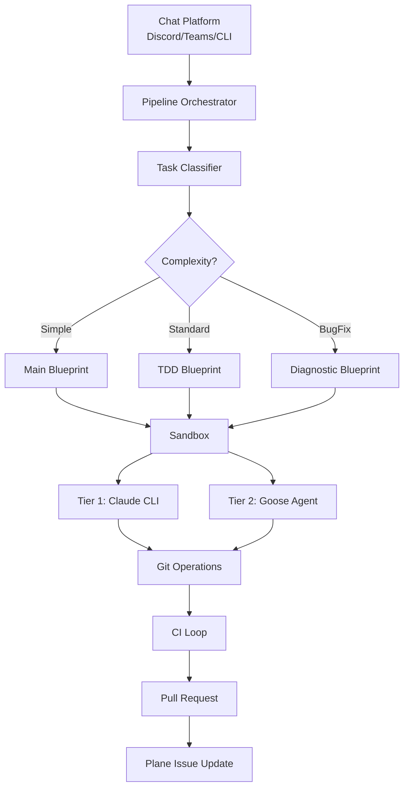

Magpie is an autonomous AI coding pipeline built with Rust, designed to take tasks from chat platforms (Discord, Teams, CLI) and execute them end-to-end: from code generation to testing, linting, and opening pull requests.

## Core Components

<CardGroup cols={2}>
  <Card title="Pipeline Orchestrator" icon="gears">
    Coordinates the full workflow from task receipt to PR creation
  </Card>
  <Card title="Blueprint Engine" icon="diagram-project">
    Executes deterministic + agent steps with conditional flow control
  </Card>
  <Card title="Two-Tier Agents" icon="layer-group">
    Tier 1 for text generation, Tier 2 for coding tasks
  </Card>
  <Card title="Sandbox Abstraction" icon="box">
    Isolates execution in local or remote environments
  </Card>
</CardGroup>

## System Architecture



## Two-Tier Agent Architecture

Magpie uses two tiers of LLM interaction, each optimized for its purpose:

### Tier 1: Claude CLI (Simple Text Generation)

**Used for:** Branch name generation, task classification, commit messages

**Mechanism:** Direct `claude -p` calls — one-shot, clean text responses

```rust title="pipeline.rs:1318-1339"
async fn claude_call(prompt: &str, step_name: &str, trace_dir: Option<&PathBuf>) -> Result<String> {
    let mut tb = TraceBuilder::new(step_name, prompt);

    let output = tokio::process::Command::new("claude")
        .args(["-p", prompt])
        .env_remove("CLAUDECODE")
        .output()
        .await
        .context("failed to run `claude` CLI — is it installed and on PATH?")?;

    if !output.status.success() {
        let stderr = String::from_utf8_lossy(&output.stderr);
        tb.record_event(EventKind::Error, &stderr);
        let trace = tb.finish("");
        if let Some(dir) = trace_dir {
            let _ = trace::write_trace(&trace, dir);
        }
        anyhow::bail!("claude CLI failed: {stderr}");
    }

    let response = String::from_utf8_lossy(&output.stdout).trim().to_string();
    Ok(response)
}
```

<Note>
Tier 1 bypasses Goose entirely to avoid streaming fragmentation. It's perfect for tasks that need a single, clean text response.
</Note>

### Tier 2: MagpieAgent (Full Coding Tasks)

**Used for:** File edits, shell commands, test writing, implementation

**Mechanism:** Goose agent loop with streaming and tool access

```rust title="agent.rs:41-51"
pub struct MagpieAgent {
    config: MagpieConfig,
    agent: Agent,
    session_manager: Arc<SessionManager>,
}

impl MagpieAgent {
    pub fn new(config: MagpieConfig) -> Result<Self> {
        let agent = Agent::new();
        let session_manager = Arc::new(SessionManager::instance());
        Ok(Self { config, agent, session_manager })
    }
}
```

The agent runs prompts with full tool access:

```rust title="agent.rs:60-105"
pub async fn run(
    &self,
    prompt: &str,
    working_dir: Option<&PathBuf>,
    step_name: Option<&str>,
) -> Result<String> {
    let step_label = step_name.unwrap_or("agent");
    let mut tb = TraceBuilder::new(step_label, prompt);

    // Create provider
    let provider = create_with_named_model(
        &self.config.provider,
        &self.config.model,
        Vec::<ExtensionConfig>::new(),
    ).await?;

    // Create session with working directory
    let working_dir = match working_dir {
        Some(dir) => dir.clone(),
        None => std::env::current_dir().unwrap_or_else(|_| PathBuf::from(".")),
    };
    let session = self
        .session_manager
        .create_session(working_dir, "magpie".to_string(), SessionType::Hidden)
        .await?;

    self.agent.update_provider(provider, &session.id).await?;

    let session_config = SessionConfig {
        id: session.id.clone(),
        schedule_id: None,
        max_turns: Some(self.config.max_turns),
        retry_config: None,
    };

    let user_message = Message::user().with_text(prompt);
    let mut stream = self.agent.reply(user_message, session_config, None).await?;

    // Collect assistant text and trace events
    let mut response = String::new();
    while let Some(event) = stream.next().await {
        match event {
            Ok(AgentEvent::Message(msg)) => {
                for content in msg.content.iter() {
                    if let Some(text) = content.as_text() {
                        response.push_str(text);
                        tb.record_event(EventKind::Text, text);
                    }
                }
            }
            Err(e) => tb.record_event(EventKind::Error, &e.to_string()),
            _ => {}
        }
    }

    Ok(response)
}
```

## ChatPlatform Trait

All chat adapters implement a unified interface:

```rust title="platform.rs:4-24"
#[async_trait]
pub trait ChatPlatform: Send + Sync {
    /// Platform identifier (e.g., "discord", "teams", "slack").
    fn name(&self) -> &str;

    /// Fetch conversation history from a channel/thread, formatted as text.
    async fn fetch_history(&self, channel_id: &str) -> Result<String>;

    /// Send a message to a channel/thread.
    async fn send_message(&self, channel_id: &str, text: &str) -> Result<()>;

    /// Close / archive a thread after the final response has been sent.
    ///
    /// Default is a no-op — platforms that support thread archiving (e.g. Discord)
    /// override this.
    async fn close_thread(&self, _channel_id: &str) -> Result<()> {
        Ok(())
    }
}
```

<Info>
This keeps `magpie-core` platform-agnostic. Discord, Teams, and CLI all plug in through the same interface.
</Info>

## Pipeline Result

Every pipeline run returns a structured result:

```rust title="pipeline.rs:69-88"
#[derive(Debug, Clone, Serialize, Deserialize)]
pub struct PipelineResult {
    pub output: String,
    pub pr_url: Option<String>,
    pub plane_issue_id: Option<String>,
    pub ci_passed: bool,
    pub rounds_used: u32,
    pub status: PipelineStatus,
}

#[derive(Debug, Clone, PartialEq, Eq, Serialize, Deserialize)]
pub enum PipelineStatus {
    Success,        // Agent + CI passed
    PartialSuccess, // Agent passed, CI failed
    AgentFailed,    // Agent execution failed
    SetupFailed,    // Pre-flight checks failed
}
```

Chat adapters format this into concise status messages rather than dumping raw agent output.

## Design Principles

<AccordionGroup>
  <Accordion title="1. Hybrid Orchestration">
    Deterministic steps + agent steps. The engine controls flow, not the LLM.
  </Accordion>
  
  <Accordion title="2. Pre-Hydrate Context">
    The chat thread IS the requirements. No duplication or external docs.
  </Accordion>
  
  <Accordion title="3. Shift Testing Left">
    Local lint before CI. TDD for Standard tasks (write tests before implementation).
  </Accordion>
  
  <Accordion title="4. Cap CI Retries">
    Max 2 rounds. Partial success is OK — better to have a PR with known issues than no progress.
  </Accordion>
  
  <Accordion title="5. Curated Tool Subsets">
    Each task gets only the tools it needs. No kitchen-sink access.
  </Accordion>
  
  <Accordion title="6. Sandbox = Permissions">
    Isolated devbox per run. Clean slate, no cross-contamination.
  </Accordion>
  
  <Accordion title="7. Two-Tier LLM">
    Right tool for the job. Tier 1 for text, Tier 2 for coding.
  </Accordion>
  
  <Accordion title="8. Classify Then Execute">
    Task complexity determines the blueprint path (Simple/Standard/BugFix).
  </Accordion>
</AccordionGroup>

## Project Structure

```
crates/
  magpie-core/       # Core library — all other crates depend on this
    ├── agent.rs        # MagpieAgent (Tier 2 wrapper)
    ├── pipeline.rs     # Pipeline orchestrator + Tier 1 calls
    ├── blueprint/      # Blueprint engine
    ├── sandbox/        # Sandbox abstraction
    ├── git.rs          # Git operations
    ├── platform.rs     # ChatPlatform trait
    └── ...
  magpie-cli/        # CLI binary
  magpie-discord/    # Discord bot adapter (Serenity)
  magpie-teams/      # Teams webhook adapter (Axum)
```

<Note>
Most work happens in `magpie-core`. The adapters are thin: they implement `ChatPlatform`, build a `PipelineConfig` from env vars, and call `run_pipeline()`.
</Note>

## Next Steps

<CardGroup cols={2}>
  <Card title="Pipeline Flow" icon="route" href="/concepts/pipeline">
    Understand the full pipeline execution from task to PR
  </Card>
  <Card title="Blueprint Engine" icon="diagram-project" href="/concepts/blueprints">
    Learn how blueprints orchestrate deterministic + agent steps
  </Card>
  <Card title="Task Classification" icon="tags" href="/concepts/task-classification">
    See how tasks are classified into Simple, Standard, and BugFix
  </Card>
  <Card title="Sandbox Abstraction" icon="box" href="/concepts/sandbox">
    Explore local and remote sandbox implementations
  </Card>
</CardGroup>